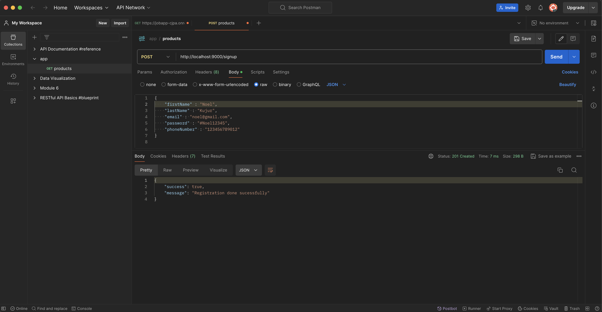

# Error Handling Middleware for User Registration

## Overview

This project implements a basic user registration and sign-in system using Node.js and the Express framework. It includes a middleware function for validating user input during the registration process. The middleware ensures that all necessary fields are present and that they adhere to specific validation rules, such as proper capitalization, email format, password complexity, and phone number length.

## Postman Screenshort


## Features

- `User Registration`: Users can register by providing their first name, last name, email, password, and phone number.

- `Input Validation`: The middleware checks the validity of user input, including:
    - Both first name and last name are required.
    - First letters of the first name and last name must be capitalized.
    - A valid email address is required.
    - The password must contain at least one special character, one uppercase letter, one numeric character, and be at least 8 characters long.
    - The phone number must be between 10 and 15 digits.

- `Error Handling`: The middleware returns appropriate error messages if any validation fails.

- `User Sign-in`: Users can sign in (this example is a placeholder and does not include authentication logic).

- `404 Handling`: Any unknown routes return a 404 error with an appropriate message.

## Installation
1. Clone the repository:
```bash
git clone https://github.com/Lovenoelkujur/error-handling-middleware.git
cd error-handling-middleware
```

2. Install dependencies:
```bash
npm install
```

3. Run the server:
```bash
node app.js
```

## API Endpoints

### POST /signup

- *Description*: Registers a new user after validating the input.

- Request Body:
```json
{
    "firstName" : "Noel",
    "lastName" : "Kujur",
    "email" : "noel@gmail.com",
    "password" : "#Noel12345",
    "phoneNumber" : "123456789012"
}
```
- Responses:

    - `201 Created`: Registration done successfully.
    ```json
    {
        "success": true,
        "message": "Registration done sucessfully"
    }
    ```
    - `400 Bad Request`: Various validation errors.
    ```json
    {
        "success": false,
        "error": "Error message"
    }
    ```
### GET /signin

- *Description*: Placeholder endpoint for user sign-in.

- Responses:

    - `200 OK`: User sign-in successfully
    ```json
    {
        "success": true,
        "message": "User sign in successfully"
    }
    ```
### Any other route

- *Description*: Handles unknown routes.

- Responses:
    - 404 Not Found: Unknown path.
    ```json
    {
        "success": false,
        "error": "Unknown path"
    }
    ```

## Middleware

### Error Handling Middleware

The middleware function errHandleMiddleware validates the user input during the registration process:

- `Name Capitalization`: Checks if the first letter of the first and last names are capitalized and both are mention.

- `Email Validation`: Ensures the email contains an "@" symbol.

- `Password Validation`: Checks if the password has at least one special character, one uppercase letter, one numeric character, and is at least 8 characters long.

- `Phone Number Validation`: Verifies that the phone number is between 10 and 15 digits.
 
If any validation fails, the middleware responds with a 400 Bad Request status and an appropriate error message.

### Example Usage

To register a user, send a POST request to `/signup` with a JSON body containing the required fields. If the input is valid, the server will respond with a success message. If any validation fails, you will receive a descriptive error message.

### License

This project is licensed under the MIT License. See the LICENSE file for details.
